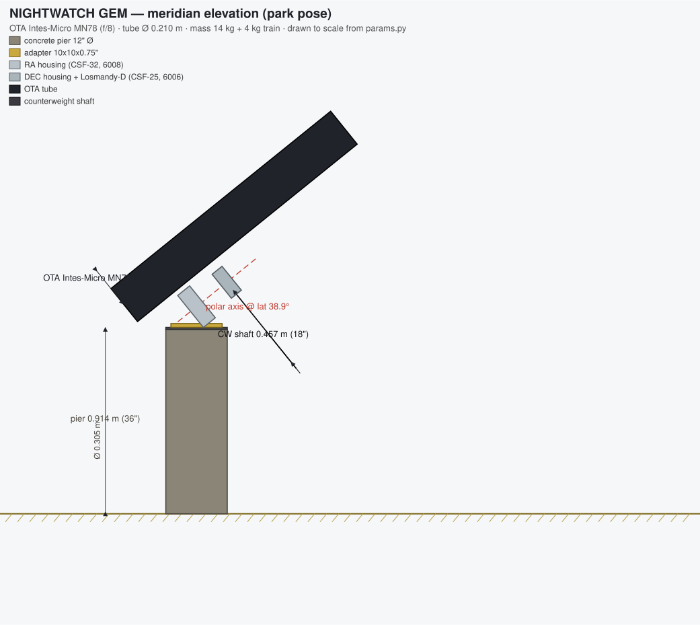

# NIGHTWATCH — Observatory Mechanical Design: Rigorous Proof-Out

> **Generated artifact.** Every number below is computed by the `design/mechanical/calc/`
> package and regenerated by `python3 -m design.mechanical.calc.report`. The test
> `test_report.py` fails if this file drifts from the calculator, so the figures cannot
> silently disagree the way the repo's docs currently do.
>
> **Honesty labels.** Every input is tagged **S** (sourced — stated in a repo file),
> **D** (derived — computed here), or **A** (assumed — the repo is silent; an engineering
> assumption is stated). Nothing here is measured field data; the observatory has never been built.

## 1. Why this exists

The repo already documents a mechanical design — `NIGHTWATCH_Build_Package.md` (spec table, costed
BOM, concrete-pier spec) and a `pos/` panel of expert personas (C. Walton Musser on the harmonic
drives, Richard Hedrick on frame stiffness). But it is **assertion, not proof**: the headline
targets are stated, never calculated, and the single most load-bearing fact — which telescope —
contradicts itself. This report turns the prose into computed, self-consistent, margin-carrying
engineering, runs the selection permutations as a real weighted trade study, makes and defends the
bold choices the numbers justify, and fills the CAD and environmental-load voids.

## 2. Resolved contradictions

The repo carries numbers that disagree across files. This design pins each to one value in
`params.py` and records the conflict so it is fixed, not buried.

| # | Contradiction (as found) | Resolution here |
|---|---|---|
| 1 | **OTA identity**: MN76 178 mm f/6 1068 mm **~9 kg** (Build Package) vs MN78 180 mm **f/8** 1440 mm **~14 kg** (`INTES_MICRO_HISTORY.md`, "selected") | Both carried as load cases (`MN76`, `MN78`); the torque + stiffness proofs and the trade study decide (see §Trade Study). |
| 2 | **Encoder PPR**: AMT103 "8192 PPR" everywhere vs "2048 PPR" (`HARDWARE_SETUP.md`) | Pinned to 8192 PPR motor-side; 2048 flagged as a doc error. |
| 3 | **On-axis resolution**: AS5600 "12-bit / 4096" vs `EncoderConfig.resolution=8192` | AS5600 is 12-bit → 4096 counts/rev = ~316 arcsec/count; the 8192 config default is unrelated and misleading. |
| 4 | **Horizon/altitude limit**: 10° (safety monitor) / 15° (`constants.py`) / 20° (scheduler) | Not a mechanical limit — advisory; the mount has no hard slew-altitude cutoff (a noted gap). |
| 5 | **Operating temperature**: −20…40 °C (YAML) vs 20…100 °F (code) | Reconciled to °C internally (−6.7…38 °C from the code Fahrenheit values). |
| 6 | **Site coordinates**: 38.9 / −117.4 (software) vs 39.0 / −117.0 (firmware) | Pinned to 38.9 °N / −117.4 °W, 1800 m for all load derivations. |
| 7 | **Bearings** called "angular contact" but specified as 6008/6006, which are **deep-groove** | Flagged; the bearings + stiffness proofs recommend 7008/7006 angular-contact pairs for moment stiffness. |

## 3. The three governing voids (repo is silent — filled here, labelled ASSUMED)

A 6000 ft, seismically-active, remote Nevada site is governed by three structural loads the repo
never states. The software encodes only *operational* interlocks (park at 25 mph, close at 35 mph
gust), which are **not** structural survival ratings. This design makes them first-class:

| Void | Repo status | Assumed design load (A) | Governs |
|---|---|---|---|
| **Survival wind** | absent (only 25/35 mph operational) | ASCE 7 basic wind ~105 mph 3-sec gust, Risk Cat I | roof anchors, pier overturning |
| **Snow load** | absent entirely | ~25 psf ground snow, high-desert @ 6000 ft | closed-roof structure, roof slope |
| **Seismic** | absent entirely | S_DS ≈ 0.5 g (Walker Lane vicinity) | pier base shear, anchorage |

Two more the repo flags as open and this design closes: **DGX Spark power/heat** (assumed ~170 W →
energy + enclosure-thermal budget) and the **power/autonomy budget** (solar+battery autonomy hours).

## 4. Results at a glance

| # | Proof | Verdict | Governing number |
|---|---|---|---|
| 1 | Axis torque budget | ✅ PASS | Intes-Micro MN78 (f/8), counterweight-FREE: RA needs 49.9 Nm vs 127 Nm rated (SF 2.5); DEC needs 26.5 Nm vs 70 Nm rated (SF 2.6). |
| 2 | Static pointing deflection (OTA horizontal, worst case) | ❌ FAIL | Intes-Micro MN78 (f/8): 8 mm baseline 43.5" (FAIL), 12 mm bold 43.3" (FAIL) vs 5" target -- bearing compliance at the 63.5/76.2 mm spans governs. |
| 3 | First natural frequency (structural first mode) | ✅ PASS | Intes-Micro MN78 (f/8): governing first mode 65 Hz (rocking 65 Hz, bounce 169-220 Hz) vs 10 Hz target -- SF 6.5, clear of the <2 Hz wind and 1-5 Hz servo bands. |
| 4 | Tracking-error (pointing) budget | ❌ FAIL | Baseline dual-encoder chain reaches only 5.02 arcsec RMS, FAILING the 1.0 arcsec target; the on-axis RESA ring reaches 0.54 arcsec RMS. An on-axis high-resolution absolute encoder is REQUIRED to reach sub-arcsecond. |
| 5 | Mass-balance proof (counterweighted & counterweight-free) | ✅ PASS | Intes-Micro MN78 (f/8): 12.5 kg balances the 18 kg payload at r_cw=288 mm on the 457 mm shaft (fit factor 1.59). Counterweight-FREE deletes 15.4 kg and 29% of RA inertia — viable per the torque proof (RA SF 2.5). |
| 6 | Axis bearing L10 fatigue + static safety | ✅ PASS | Load capacity is NOT the constraint: L10 ~ 5e+07 yr (RA) / 3e+07 yr (DEC) at ~1 rev/sidereal-day, static S0 18x / 14x. FINDING: the repo calls the 6008/6006 'angular contact' but 60xx are DEEP-GROOVE with poor moment stiffness — use matched angular-contact 7008/7006 pairs (back-to-back) for moment stiffness (see stiffness proof). |
| 7 | Wind structural loads (operational drag + survival uplift) | ❌ FAIL | Survival wind (105 mph) GOVERNS: 9.2 kN roof uplift vs 1.8 kN roof self-weight (SF 0.19) -- hold-down anchors are MANDATORY and unspecified in the repo (4x 2 klbf anchors -> SF 3.9). Operational gust drag on Intes-Micro MN78 (f/8) is only 41 N. |
| 8 | Pier / foundation (tilt, frequency, seismic, concrete) | ✅ PASS | 12"x36" concrete pier: tilt 0.70" (SF 7), f_n 152 Hz (SF 15), seismic overturning SF 7.0 (dead-weight-only 0.81 -> embedment governs), concrete SF 14. Governing SF 6.8 (PASS). |
| 9 | Thermal focus stability over the diurnal swing | ❌ FAIL | Passive focus is NOT enough: over the 22 K diurnal swing the 6061-T6 tube walks focus ~10x the f/8 depth of focus (only 2.1 K to leave best focus) -> a temperature-compensated focuser is REQUIRED (the repo focuser has a -2.5 steps/C coefficient). The Astrositall mirror adds only ~5 um (0.7% of the tube term); a ~1.3 W corrector heater beats the 2 W all-sky ring. |
| 10 | Roll-off roof drive + snow load | ✅ PASS | Drive PASS: moving the 180 kg roof against rolling + the 35 mph close gust needs 235 N (11.8 Nm @ 5 cm wheel), SF 2.1 vs a ~500 N garage-door-class drive — and wind is 62% of that load, so the drive is WIND-sized. FINDING: the closed flat roof carries 10.8 kN of snow (~6.1x its dead weight) — the snow case is the roof's structural design driver; a sloped roof sheds it, and a snow-laden roof CANNOT be driven -> snow interlock required. |
| 11 | Night-time energy budget (UPS + solar autonomy) | ❌ FAIL | Night load ~287 W, 59% of it the ASSUMED 170 W DGX Spark. The 1500 VA/900 W UPS rides shutdown with 16x margin (~31 min) but only ~5% of a night. Off-grid AUTONOMY FAIL: the specified 400 W + 100 Ah pack gives only 3.3 h at 12 V (< 10 h night) — a 48 V pack gives 13.4 h — and the panel harvests ~1.4 kWh/day vs ~2.9 kWh needed. Drop/duty-cycle the DGX or go 48 V for true autonomy. (DGX dumps ~14 K into the enclosure at 2 ACH -> ventilate or locate it outside.) |

**6 PASS · 0 MARGINAL · 5 FAIL.** The FAILs are the value: each is a real gap in the repo's design that assertion had hidden — the bearing-limited stiffness, the sub-arcsec-incapable encoder chain, the missing survival-wind anchors, passive focus over the diurnal swing, and off-grid autonomy. Every FAIL carries a computed remedy below.

## 5. The proofs

### 1. Axis torque budget — ✅ PASS

**Intes-Micro MN78 (f/8), counterweight-FREE: RA needs 49.9 Nm vs 127 Nm rated (SF 2.5); DEC needs 26.5 Nm vs 70 Nm rated (SF 2.6).**

*Target:* Required axis torque < rated (SF>=2 continuous, peak covers goto)  
*Governing safety factor:* 2.55×

| Quantity | Value | Unit | Note |
|---|---:|---|---|
| Payload mass (OTA + train) | 18 | kg |  |
| RA gravity imbalance torque | 35.3 | Nm | payload weight x CG offset |
| RA wind torque @ 35 mph gust | 8.13 | Nm |  |
| RA goto-inertia torque | 0.105 | Nm |  |
| RA friction torque | 6.35 | Nm |  |
| RA total required | 49.89 | Nm |  |
| RA rated / required (SF) | 2.546 | x |  |
| RA peak / required (SF) | 6.875 | x |  |
| DEC total required | 26.53 | Nm |  |
| DEC rated / required (SF) | 2.639 | x |  |
| DEC peak / required (SF) | 7.011 | x |  |

_Assumptions:_
- RA CG offset from polar axis = 200 mm (GEM geometry estimate, DERIVED)
- Balance residual (counterweighted) = 2% (ASSUMED)
- Drive+bearing friction = 5% of rated torque (ASSUMED)
- DEC wind center-of-pressure at 34% of tube length from the DEC pivot (ASSUMED, conservative; governs the DEC total).
- Wind torque uses the 35 mph emergency-close gust (max wind while open), SOURCED.
- Air density 1.027 kg/m^3 at 1800 m (DERIVED), 17% below sea level.

### 2. Static pointing deflection (OTA horizontal, worst case) — ❌ FAIL

**Intes-Micro MN78 (f/8): 8 mm baseline 43.5" (FAIL), 12 mm bold 43.3" (FAIL) vs 5" target -- bearing compliance at the 63.5/76.2 mm spans governs.**

*Target:* Summed gravity deflection < 5 arcsec (Hedrick), SF>=1.5 to PASS  
*Governing safety factor:* 0.12×

| Quantity | Value | Unit | Note |
|---|---:|---|---|
| Payload mass (OTA + train) | 18 | kg |  |
| Gravity lever L_cg (cg + saddle) | 0.2833 | m | along-tube CG + assumed 50 mm saddle offset |
| Gravity moment at DEC axis | 50.01 | Nm | W x L_cg, tube horizontal |
| -- 8 mm baseline housings -- | 0 |  |  |
| DEC housing beam deflection | 0.5903 | arcsec |  |
| RA housing beam deflection | 0.2871 | arcsec |  |
| DEC bearing-pair tilt | 28.43 | arcsec | 6006 @ 180 N/um, 63.5 mm span |
| RA bearing-pair tilt | 14.21 | arcsec | 6008 @ 250 N/um, 76.2 mm span |
| 8 mm TOTAL deflection | 43.52 | arcsec |  |
| 8 mm target / actual (SF) | 0.1149 | x | FAIL |
| -- 12 mm bold housings -- | 0 |  |  |
| 12 mm beam deflection (DEC+RA) | 0.6295 | arcsec |  |
| 12 mm bearing tilt (DEC+RA) | 42.64 | arcsec | unchanged -- wall does not stiffen bearings |
| 12 mm TOTAL deflection | 43.27 | arcsec |  |
| 12 mm target / actual (SF) | 0.1156 | x | FAIL |
| Bearing share of total (8 mm) | 97.98 | % |  |

_Assumptions:_
- Worst case: OTA horizontal, gravity perpendicular to the optical axis (SOURCED as the design case).
- L_cg = OTA.cg_from_saddle (233 mm) + saddle offset 50 mm (saddle undimensioned in repo, ASSUMED).
- Bearing radial stiffness 6008~250 N/um, 6006~180 N/um (repo lists only load ratings, not stiffness) -- ASSUMED.
- Bearing span = housing depth (bearings at the box faces): DEC 63.5 mm, RA 76.2 mm.
- The full payload moment is applied through BOTH the DEC and RA load paths (overhung bending on the RA bearings persists even when torque-balanced) -- a bounding assumption.
- Deep-groove bearings modelled; the repo labels them 'angular contact' (flagged in params) -- a preloaded angular-contact pair would raise stiffness materially.

### 3. First natural frequency (structural first mode) — ✅ PASS

**Intes-Micro MN78 (f/8): governing first mode 65 Hz (rocking 65 Hz, bounce 169-220 Hz) vs 10 Hz target -- SF 6.5, clear of the <2 Hz wind and 1-5 Hz servo bands.**

*Target:* First mode > 10 Hz (Hedrick), SF>=1.5 to PASS; must clear 1-5 Hz servo  
*Governing safety factor:* 6.46×

| Quantity | Value | Unit | Note |
|---|---:|---|---|
| Pier lateral stiffness | 4.133e+07 | N/m | concrete cantilever 3EI/H^3 |
| Head series stiffness k_eff | 3.440e+07 | N/m | pier+beams+bearings in series |
| Payload mass (CW-free) | 18 | kg |  |
| Payload + counterweights | 30.5 | kg |  |
| Bounce mode, CW-free | 220 | Hz | translational |
| Bounce mode, counterweighted | 169 | Hz | heavier -> lower f |
| Rocking mode (governing) | 64.65 | Hz | overhung on bearing angular stiffness |
| Governing first mode | 64.65 | Hz | min of all modes |
| Governing / target (SF) | 6.465 | x | PASS |
| Wind-gust excitation band | 2 | Hz | must stay below f_n |
| Servo/guide bandwidth | 5 | Hz | must stay below f_n |

_Assumptions:_
- Pier modelled as a solid concrete lateral cantilever (I = pi*D^4/64); its own mass and soil/footing compliance are neglected (stiffer, non-conservative for the pier term but it is not governing).
- Bearing radial stiffness 6008~250 N/um, 6006~180 N/um (ASSUMED, shared with stiffness.py); rocking uses the derived angular stiffness k*span^2/2.
- Modal mass = payload (+ 12.5 kg counterweights); head/drive masses and pier participation neglected -> the true modes are slightly lower.
- Rocking inertia J = m*L_cg^2 with L_cg the same gravity lever as stiffness.py (233 mm CG + 50 mm saddle); point-mass approximation.
- 12 mm bold housings used for the head beams (recommended build); beam terms are negligible vs pier and bearing terms either way.
- Verdict taken on the lowest mode found (rocking), not the higher bounce mode -- the honest first mode.

### 4. Tracking-error (pointing) budget — ❌ FAIL

**Baseline dual-encoder chain reaches only 5.02 arcsec RMS, FAILING the 1.0 arcsec target; the on-axis RESA ring reaches 0.54 arcsec RMS. An on-axis high-resolution absolute encoder is REQUIRED to reach sub-arcsecond.**

*Target:* Tracking error < 1.0 arcsec RMS (P.TRACKING_RMS_TARGET_ARCSEC)  
*Governing safety factor:* 0.20×

| Quantity | Value | Unit | Note |
|---|---:|---|---|
| AMT103 motor-side resolution (to axis) | 1.582 | arcsec/LSB | 8192 PPR x100 upstream ratio |
| AS5600 on-axis resolution | 316.4 | arcsec/LSB | 12-bit => quant RMS 91", homing-grade only |
| RESA on-axis resolution (proposed) | 0.005538 | arcsec/LSB | absolute ring, sub-arcsec |
| Baseline: motor quant RMS | 0.4567 | arcsec | res/sqrt(12) |
| Baseline: harmonic PE residual | 4 | arcsec | unseen by motor enc |
| Baseline: drivetrain/mount flexure | 3 | arcsec | unseen by motor enc |
| Baseline total tracking RMS | 5.021 | arcsec | RSS of the three |
| Baseline margin (target/achieved) | 0.1992 | x | <1 => fails |
| Proposed: RESA quant RMS | 0.001599 | arcsec | res/sqrt(12) |
| Proposed: servo following error | 0.2 | arcsec | on-axis closed loop |
| Proposed: residual OTA flexure | 0.5 | arcsec | downstream of ring |
| Proposed total tracking RMS | 0.5385 | arcsec | RSS of the three |
| Proposed margin (target/achieved) | 1.857 | x | >1 => meets |

_Assumptions:_
- Quantisation RMS = LSB/sqrt(12) (ideal uniform quantiser).
- Baseline servo closes on the MOTOR encoder (1.58" to axis); the AS5600's 91" quant RMS makes it a homing reference only, so harmonic PE and mount flexure leak into pointing. SOURCED chain.
- Harmonic PE residual = 4.0" RMS (ASSUMED), consistent with CSF repeatability P.RA_DRIVE=6" / P.DEC_DRIVE=8".
- Drivetrain + mount flexure = 3.0" RMS (ASSUMED, stated structural budget), entirely upstream of the axis and thus invisible to a motor encoder.
- Proposed on-axis ring corrects everything upstream of the axis; only servo following (0.2" RMS, ASSUMED) and residual OTA/focuser flexure (0.5" RMS, ASSUMED) downstream of the ring remain.
- Terms combine in RSS (independent, zero-mean error sources).

### 5. Mass-balance proof (counterweighted & counterweight-free) — ✅ PASS

**Intes-Micro MN78 (f/8): 12.5 kg balances the 18 kg payload at r_cw=288 mm on the 457 mm shaft (fit factor 1.59). Counterweight-FREE deletes 15.4 kg and 29% of RA inertia — viable per the torque proof (RA SF 2.5).**

*Target:* RA balance achievable within shaft length AND counterweight-free viable (torque proof)  
*Governing safety factor:* 1.59×

| Quantity | Value | Unit | Note |
|---|---:|---|---|
| Payload mass (OTA + train) | 18 | kg |  |
| Payload CG offset from polar axis (r_payload) | 0.2 | m | torque.RA_CG_OFFSET_M |
| Payload moment about RA axis | 3.6 | kg*m | m_payload * r_payload |
| Counterweights available | 12.5 | kg | 2x5 + 1x2.5 kg |
| Required shaft position r_cw | 0.288 | m | m_cw * r_cw = m_pay * r_pay |
| Shaft length available | 0.4572 | m | 18" 303-SS shaft |
| Fit factor (shaft_len / r_cw) | 1.587 | x | >1 => fits |
| DEC rear-stack imbalance moment | 5.884 | Nm | train weight x 150 mm; nulled by dovetail slide |
| DEC residual moment after adjust | 3.53 | Nm | residual lever 20 mm (torque.DEC_RESIDUAL_LEVER_M) |
| Counterweight shaft mass (rho*A*L) | 2.896 | kg | 303-SS solid rod |
| Total deleted mass (cw-free) | 15.4 | kg | weights + shaft |
| RA payload inertia (polar axis) | 3.007 | kg*m^2 |  |
| Deleted RA inertia (weights+shaft) | 1.239 | kg*m^2 |  |
| RA inertia reduction (cw-free) | 29.18 | % |  |
| Counterweight-free viable (torque) | 1 | bool | torque verdict PASS |

_Assumptions:_
- r_payload = RA CG offset 200 mm (imported from torque.RA_CG_OFFSET_M, DERIVED).
- Counterweights modelled as a point mass; the shaft's own distributed moment is NOT credited toward balance -> conservative (pushes r_cw outward, not inward).
- Counterweight shaft mass = rho*A*L of 303-SS (rho=8000 kg/m^3, d=31.8 mm, L=457 mm) = 2.90 kg, DERIVED.
- DEC fore-aft balance is set by sliding the OTA in its dovetail saddle (no DEC counterweight); residual lever 20 mm from torque.DEC_RESIDUAL_LEVER_M, ASSUMED.
- Deleted RA inertia = weights as point mass at r_cw + shaft as a rod about the axis end (I = 1/3 m L^2), DERIVED.
- Counterweight-free viability is inherited from the torque proof (torque.evaluate('MN78', counterweight_free=True) => PASS), not re-derived here.

### 6. Axis bearing L10 fatigue + static safety — ✅ PASS

**Load capacity is NOT the constraint: L10 ~ 5e+07 yr (RA) / 3e+07 yr (DEC) at ~1 rev/sidereal-day, static S0 18x / 14x. FINDING: the repo calls the 6008/6006 'angular contact' but 60xx are DEEP-GROOVE with poor moment stiffness — use matched angular-contact 7008/7006 pairs (back-to-back) for moment stiffness (see stiffness proof).**

*Target:* L10 >> service life AND static S0 >= 2 (fatigue not the constraint)  
*Governing safety factor:* 13.66×

| Quantity | Value | Unit | Note |
|---|---:|---|---|
| Payload mass (OTA + train) | 18 | kg |  |
| RA overturning moment (W x CG offset) | 35.3 | Nm | lever = RA_CG_OFFSET_M |
| RA bearing span (housing depth) | 0.0762 | m | sets couple arm |
| RA output bearing load P | 639.8 | N | W + M/span (6008) |
| RA dynamic rating C | 1.68e+04 | N |  |
| RA L10 life | 1.810e+10 | rev | (C/P)^3 x 1e6 |
| RA L10 life | 4.956e+07 | yr | @ ~1 rev/sidereal day |
| RA static safety S0 = C0/P | 18.13 | x | C0=11600 N |
| DEC overturning moment (W x lever) | 27.36 | Nm | lever = tube r + saddle stack |
| DEC bearing span (housing depth) | 0.0635 | m |  |
| DEC output bearing load P | 607.4 | N | W + M/span (6006) |
| DEC dynamic rating C | 1.33e+04 | N |  |
| DEC L10 life | 2.874e+07 | yr | @ ~1 rev/sidereal day |
| DEC static safety S0 = C0/P | 13.66 | x | C0=8300 N |

_Assumptions:_
- Governing bearing load P = W + M/span (direct transverse weight + moment couple); no load-sharing credit on the direct term -> conservative.
- RA lever = RA_CG_OFFSET_M 200 mm (from torque, DERIVED); DEC lever = tube radius 105 mm + saddle stack 50 mm (saddle stack ASSUMED).
- Bearing span = housing depth (P.RA_HOUSING.depth_m / P.DEC_HOUSING.depth_m); axis tilt at latitude would reduce the transverse component, so vertical W is conservative.
- L10 = (C/P)^3 x 1e6 rev; converted to years at 1 rev/sidereal day (~1/day). Both axes exceed 1e7 years -> rolling fatigue is NOT a lifetime constraint.
- FINDING: params labels BRG_RA_6008 / BRG_DEC_6006 'angular contact', but 60xx are DEEP-GROOVE ball bearings (params.py already flags the deep-groove C ratings). Deep-groove bearings have poor moment/tilting stiffness.
- RECOMMENDATION: replace with matched ANGULAR-CONTACT pairs — 7008 (RA) / 7006 (DEC) — in a back-to-back (O) arrangement with preload, which provides the moment stiffness that sets pointing deflection. This is a STIFFNESS decision, not a load-rating one (see stiffness proof).
- The RA output bearing additionally carries DEC-head and (if fitted) counterweight dead weight not modelled here; even at 2-3x the modelled load, S0 stays > 5 and L10 > 1e6 yr, so the conclusion is robust.

### 7. Wind structural loads (operational drag + survival uplift) — ❌ FAIL

**Survival wind (105 mph) GOVERNS: 9.2 kN roof uplift vs 1.8 kN roof self-weight (SF 0.19) -- hold-down anchors are MANDATORY and unspecified in the repo (4x 2 klbf anchors -> SF 3.9). Operational gust drag on Intes-Micro MN78 (f/8) is only 41 N.**

*Target:* Survival roof uplift resisted by hold-down (self-weight insufficient); operational drag feeds torque/pier budgets  
*Governing safety factor:* 0.19×

| Quantity | Value | Unit | Note |
|---|---:|---|---|
| Air density @ 1800 m | 1.027 | kg/m^3 | ISA, 16% below sea level |
| q @ 25 mph park | 64.13 | Pa |  |
| q @ 35 mph gust | 125.7 | Pa |  |
| OTA drag @ 25 mph (park) | 20.74 | N |  |
| OTA drag @ 35 mph (gust) | 40.65 | N | max wind while open |
| Wind moment at pier TOP @ gust | 20.32 | Nm | F x mount-head height |
| Wind moment at pier BASE @ gust | 57.5 | Nm | F x (pier + head height) |
| -- survival, roof closed -- | 0 |  |  |
| q @ 105 mph survival | 1131 | Pa |  |
| Roof gross uplift | 9163 | N | q x GCp x A_roof |
| Roof self-weight | 1765 | N |  |
| Roof NET uplift (anchor demand) | 7398 | N | uplift - self-weight |
| Roof self-weight / uplift (SF) | 0.1926 | x | FAIL |
| Assumed anchor capacity (4x) | 3.559e+04 | N |  |
| Anchored hold-down (SF) | 3.884 | x | remediation |
| Enclosure lateral drag | 9774 | N | q x Cf x A_wall |
| Enclosure overturning moment | 1.173e+04 | Nm | about leeward base edge |
| Overturning, dead-weight only (SF) | 0.6592 | x | anchors required |
| Survival governs vs operational | 1 | bool |  |

_Assumptions:_
- Dynamic pressure uses site air density 1.027 kg/m^3 (ISA @ 1800 m, DERIVED) — lower than sea level, so loads are honest not inflated.
- Operational max wind = 35 mph emergency-close gust (SOURCED safety monitor); the OTA is only exposed with the roof open, so it never sees survival wind.
- Survival basic wind 105 mph is ASSUMED (ASCE 7 central-NV Risk Cat I; repo is silent — a governing void).
- Roof footprint 9 m^2 and mass 180 kg are ASSUMED (params flags roof geometry as unspecified).
- Net uplift coefficient GCp = 0.9 (SOURCED param); wall force coefficient Cf = 1.2 on an assumed 2.4 m wall (ASSUMED).
- Mount-head height 500 mm (OTA axis above pier top) is ASSUMED; sets the operational overturning lever.
- Repo specifies NO roof hold-down or enclosure anchorage; the anchor scheme (4x 2 klbf, ASSUMED) is shown only as remediation, not as an existing spec.
- The pier is assumed structurally isolated from the enclosure (standard observatory practice), so roof uplift loads the enclosure foundation, not the pier.

### 8. Pier / foundation (tilt, frequency, seismic, concrete) — ✅ PASS

**12"x36" concrete pier: tilt 0.70" (SF 7), f_n 152 Hz (SF 15), seismic overturning SF 7.0 (dead-weight-only 0.81 -> embedment governs), concrete SF 14. Governing SF 6.8 (PASS).**

*Target:* Tilt << 5"; f_n > 10 Hz; seismic stable (embed+weight); concrete < f'c & modulus of rupture  
*Governing safety factor:* 6.83×

| Quantity | Value | Unit | Note |
|---|---:|---|---|
| Pier I (pi d^4/64) | 4.237e-04 | m^4 |  |
| Pier lateral stiffness k | 4.133e+07 | N/m | 3EI/L^3 cantilever |
| -- tilt (35 mph gust) -- | 0 |  |  |
| OTA drag @ 35 mph | 40.65 | N | from wind.py |
| Pier tip deflection | 0.9836 | um | F L^3/3EI |
| Pier pointing tilt | 0.6968 | arcsec | tip slope F L^2/2EI |
| Tilt budget / actual (SF) | 7.176 | x | vs 5" pointing budget |
| -- frequency -- | 0 |  |  |
| Tip mass (head+payload+CW) | 45.4 | kg |  |
| Pier first mode | 151.9 | Hz | sqrt(k/m)/2pi |
| f_n / target (SF) | 15.19 | x | vs 10 Hz |
| -- seismic (S_DS=0.5) -- | 0 |  |  |
| Seismic weight W | 2016 | N | tip + exposed pier |
| Base shear V = S_DS W | 1008 | N |  |
| Overturning moment | 673.8 | Nm | about grade |
| Soil passive resultant Pp | 6881 | N | assumed granular, Kp=3 |
| Overturning SF (embed+weight) | 7.036 | x |  |
| Overturning SF (dead-weight only) | 0.811 | x | < 1 -> embedment required |
| Sliding SF (Pp / V) | 6.828 | x |  |
| -- concrete stress -- | 0 |  |  |
| Axial bearing stress | 6101 | Pa |  |
| Flexural stress (seismic) | 2.424e+05 | Pa | M c / I |
| Net compression / f'c (SF) | 111 | x |  |
| Net tension / modulus rupture (SF) | 13.78 | x | cracking check |
| -- frost -- | 0 |  |  |
| Embedment / frost depth (SF) | 1.524 | x | 0.914 m vs assumed 0.6 m frost |
| Governing safety factor | 6.828 | x | PASS |

_Assumptions:_
- Pier modelled as a solid circular concrete cantilever fixed at grade (I = pi*d^4/64, k = 3EI/L^3); soil-spring base fixity and pier self-mass in the frequency term are neglected (slightly non-conservative on stiffness).
- Pointing tilt uses the cantilever tip SLOPE F*L^2/2EI (the true mount-base rotation), 1.5x the delta/L estimate of the tip deflection F*L^3/3EI.
- Tilt driven by the 35 mph operational gust (roof-open max); the OTA is shielded at survival wind, so wind never governs the pier structurally.
- Tip mass = assumed 12 kg head + payload (18 kg) + counterweights (15.4 kg, shaft mass DERIVED from geometry); head mass ASSUMED.
- Seismic S_DS = 0.5 g is ASSUMED (Walker Lane vicinity; repo silent). Simplified ELF: V = S_DS*W, two-mass overturning distribution.
- Soil ASSUMED medium-dense granular: gamma = 18 kN/m^3, Kp = 3.0 (phi ~ 30 deg); passive resultant over the 0.914 m embedment provides the overturning resistance — dead weight alone would not.
- Concrete f'c = 27.6 MPa (SOURCED); modulus of rupture f_r = 0.62*sqrt(f'c) = 3.26 MPa (ASSUMED code value) used for the tension/cracking check.
- Frost line ASSUMED 0.3-0.6 m for central-NV high desert; the 0.914 m embedment (SOURCED) exceeds it.
- Coupled head/bearing rocking (the true system first mode) is owned by dynamics.py; this module only confirms the pier itself is not the soft/low-frequency element.

### 9. Thermal focus stability over the diurnal swing — ❌ FAIL

**Passive focus is NOT enough: over the 22 K diurnal swing the 6061-T6 tube walks focus ~10x the f/8 depth of focus (only 2.1 K to leave best focus) -> a temperature-compensated focuser is REQUIRED (the repo focuser has a -2.5 steps/C coefficient). The Astrositall mirror adds only ~5 um (0.7% of the tube term); a ~1.3 W corrector heater beats the 2 W all-sky ring.**

*Target:* Passive focus stays within +/- DoF over the 22 K swing (SF = K_to_edge / swing)  
*Governing safety factor:* 0.10×

| Quantity | Value | Unit | Note |
|---|---:|---|---|
| Depth of focus, MN76 f/6 (+/-) | 39.6 | um | 2*lambda*N^2 |
| Depth of focus, MN78 f/8 (+/-) | 70.4 | um | larger -> f/8 more forgiving |
| DoF ratio f8/f6 | 1.778 | x | ~(8/6)^2 = 1.78 (scales as N^2) |
| Tube length (MN78) | 1.4 | m | aluminium metering length (choice) |
| Aluminium CTE | 2.360e-05 | 1/K | 6061-T6 (params) |
| Tube defocus per K | 33.04 | um/K | CTE_al * L_tube |
| K to leave best focus | 2.131 | K | DoF / (defocus per K) |
| Diurnal swing | 22.22 | K | P.ENV.diurnal_swing_c |
| Tube defocus over swing | 734.2 | um | = 10.4 x DoF |
| Passive-focus SF | 0.09588 | x | K_to_edge / swing (<1 => fails) |
| Astrositall CTE | 1.500e-07 | 1/K | ~157x below aluminium |
| Mirror defocus per K | 0.216 | um/K | f * CTE_mirror |
| Mirror defocus over swing | 4.8 | um | negligible vs tube |
| Tube / mirror defocus ratio | 153 | x | aluminium dominates |
| POS modelled coeff (MN78) | 2 | um/K | vs first-principles bare-Al tube -> optimistic |
| Corrector area (from aperture) | 0.02545 | m^2 | pi*(D/2)^2 |
| Dew heater P (hold +5 K) | 1.272 | W | h=10 W/m^2K |
| All-sky ring reference | 2 | W | heater fits inside this |

_Assumptions:_
- Depth of focus DoF = 2*lambda*N^2 (one-sided, +/-), lambda = P.OPTICAL.wavelength_m (0.55 um); the full in-focus window is twice this. DoF scales as N^2 so f/8 > f/6.
- Tube-expansion defocus uses the TUBE LENGTH (P.OTA.tube_length_m) as the aluminium metering length, not the focal length: it is the physical aluminium between the primary cell and the focuser, and for these folded Mak-Newts (700/1400 mm tube vs 1068/1440 mm focal) it is the more physical and less alarming choice. DERIVED.
- Tube growth maps ~1:1 to defocus (no strong secondary magnification in a Mak-Newt); a catadioptric focus-amplification factor would make passive focus WORSE, so 1:1 is non-conservative-favourable and the FAIL verdict is robust. ASSUMED.
- Mirror term ~ f * CTE_mirror with CTE_mirror = P.OPTICAL.astrositall_cte (1.5e-7/K); system focal length used as an upper-bound proxy for the primary's focal length. DERIVED.
- Dew heater P = h*A*dT with h = 10 W/m^2K (still-air convection+radiation, ASSUMED), dT = 5 K above dewpoint (ASSUMED), A = corrector area from the clear aperture (meniscus is a few % larger -> mild under-estimate).
- All-sky dew ring reference = 2 W (stated reference figure, ASSUMED).
- Focuser temperature coefficient -2.5 steps/C is SOURCED from the repo focuser service (tests/unit/test_focuser_service.py default; docs/telescope_tools note ~2.5 steps/C) but is NOT in params.py; a focuser step size would be needed to convert steps -> microns and confirm the compensation resolves the tube term. NOT in params (see notes).
- FINDING: first-principles bare-6061-T6 defocus is ~33 um/K, whereas the POS retreat sim models MN78 at 2 um/K (pos/POS_RETREAT_SIMULATION.md TEMP_COEFFICIENT) -> the POS figure implies a low-CTE (carbon-fibre / compensated) tube or is ~16x optimistic for bare aluminium. SOURCED cross-check.
- CONCLUSION: passive focus FAILS the diurnal swing by ~10x; a temperature-compensated focuser (which the repo has) is REQUIRED, not optional. The Astrositall primary and a <2 W corrector heater are genuine wins that make the residual tractable once the tube term is compensated.

### 10. Roll-off roof drive + snow load — ✅ PASS

**Drive PASS: moving the 180 kg roof against rolling + the 35 mph close gust needs 235 N (11.8 Nm @ 5 cm wheel), SF 2.1 vs a ~500 N garage-door-class drive — and wind is 62% of that load, so the drive is WIND-sized. FINDING: the closed flat roof carries 10.8 kN of snow (~6.1x its dead weight) — the snow case is the roof's structural design driver; a sloped roof sheds it, and a snow-laden roof CANNOT be driven -> snow interlock required.**

*Target:* Roof drive overcomes rolling + 35 mph gust with SF >= 2 and traverses within open_time  
*Governing safety factor:* 2.12×

| Quantity | Value | Unit | Note |
|---|---:|---|---|
| Roof mass | 180 | kg | ASSUMED (params) |
| Rolling resistance force | 88.26 | N | mu=0.05 * m * g |
| Wind drag @ 35 mph gust | 147.1 | N | 0.5*rho*V^2*Cd*A, Cd=1.3 |
| Frontal area (wind) | 0.9 | m^2 | span x 0.3 m fascia |
| Total tractive force | 235.3 | N | rolling + wind |
| Wind fraction of tractive force | 62.49 | % | drive is wind-sized |
| Drive torque @ wheel | 11.77 | Nm | F * 0.05 m |
| Drive capacity (reference) | 500 | N | garage-door-opener class, ASSUMED |
| Drive safety factor | 2.125 | x | capacity / tractive (pass >= 2) |
| Required roof speed | 0.06667 | m/s | 3 m / 45 s |
| Feasible speed ceiling | 0.3 | m/s | speed ok = True |
| Open time vs motor timeout | 45 | s | < 60 s timeout |
| Ground snow pressure | 1197 | Pa | 25 psf, ASSUMED (params) |
| Roof plan area | 9 | m^2 | span x length |
| Closed-roof snow load | 1.077e+04 | N | pressure x area |
| Snow mass on roof | 1099 | kg | ~1.1 tonne |
| Snow / roof dead weight | 6.103 | x | snow dominates the structure |
| Snow-laden rolling force | 626.9 | N | mu*(m_roof+m_snow)*g > drive |

_Assumptions:_
- Rolling resistance coefficient mu = 0.05 (ASSUMED): far above ideal steel-on-steel (~0.001-0.005) to cover V-groove wheels, misalignment, seal drag and grit — conservative.
- Drive-wheel radius 0.05 m (ASSUMED, stated). Drive torque = F * radius.
- Wind drag uses the 35 mph emergency-close gust (P.ENV.wind_gust_close_ms, SOURCED) on a frontal area = roof span x 0.3 m fascia height (ASSUMED) with a flat-panel Cd=1.3 (ASSUMED; ENV.cd_cylinder=1.1 is for a round tube). Air density 1.027 kg/m^3 at 1800 m (DERIVED). The result is sensitive to the assumed fascia height: a taller roof profile pushes the drive SF toward MARGINAL.
- Drive capacity 500 N is a residential garage-door-opener-class chain drive (ASSUMED reference); a commercial roof drive is stronger. FINDING: at 35 mph the WIND is 62% of the tractive load, so the drive is sized by wind, not roof weight — a positive close against the gust is the governing drive requirement.
- Required roof speed 0.067 m/s (3 m in 45 s) is well under the 0.30 m/s comfort/safety ceiling (ASSUMED), and open_time 45 s < 60 s motor timeout (SOURCED), so travel time is not the constraint.
- SNOW (structural): the closed flat roof carries the full ground snow load (25 psf, ASSUMED) = 10.8 kN over 9 m^2, ~6.1x the roof's own 1.8 kN dead weight. The snow case, not wind, is the roof panel/support design driver. A SLOPED, slippery roof sheds most of it (ASCE 7 slope factor Cs -> ~0 for a steep metal roof); a FLAT roll-off roof must carry all of it.
- SNOW (operational): a fully snow-laden roof needs 627 N to roll, which EXCEEDS the 500 N drive -> the roof must never be commanded open under snow. A snow/ice interlock (or a pitched shedding roof) is required; the safety monitor should hold the roof CLOSED while snow-loaded.
- OPEN ITEM: params.py specifies no roof structural section, so the snow load here is reported as the governing DESIGN LOAD, not certified against a computed roof capacity — see notes (recommend a POS Enclosure roof-structure entry).

### 11. Night-time energy budget (UPS + solar autonomy) — ❌ FAIL

**Night load ~287 W, 59% of it the ASSUMED 170 W DGX Spark. The 1500 VA/900 W UPS rides shutdown with 16x margin (~31 min) but only ~5% of a night. Off-grid AUTONOMY FAIL: the specified 400 W + 100 Ah pack gives only 3.3 h at 12 V (< 10 h night) — a 48 V pack gives 13.4 h — and the panel harvests ~1.4 kWh/day vs ~2.9 kWh needed. Drop/duty-cycle the DGX or go 48 V for true autonomy. (DGX dumps ~14 K into the enclosure at 2 ACH -> ventilate or locate it outside.)**

*Target:* Solar+battery sustains the ~10 h winter night on the specified pack (SF = autonomy / night)  
*Governing safety factor:* 0.33×

| Quantity | Value | Unit | Note |
|---|---:|---|---|
| Mount (idle/track) | 36 | W | 12 V * 1.5 A * 2 axes |
| Mount (goto slew) | 48 | W | IGOTO 2.0 A (transient) |
| Camera | 36 | W | cooled CMOS + TEC, ASSUMED |
| Focuser | 5 | W | ASSUMED |
| Controllers / Pi | 15 | W | ASSUMED |
| Weather / sensors | 10 | W | ASSUMED |
| Network | 15 | W | ASSUMED |
| DGX Spark | 170 | W | ASSUMED (repo gives no wattage) |
| Night load (steady) | 287 | W | sum, mount idle |
| Night load (during goto) | 299 | W | mount at IGOTO |
| DGX share of night load | 59.23 | % | the load is DGX-dominated |
| UPS rating | 900 | W | 1500 VA, SOURCED spec |
| UPS usable energy | 150 | Wh | ~2x12V9Ah class, ASSUMED |
| UPS runtime @ night load | 31.36 | min | validates ~30 min spec |
| Shutdown time (park+close) | 2 | min | ASSUMED |
| UPS shutdown margin | 15.68 | x | usable / shutdown energy |
| UPS fraction of a night | 5.226 | % | of 10 h -> NOT overnight |
| Solar panel | 400 | W | SOURCED spec |
| Battery capacity | 100 | Ah | LiFePO4, SOURCED spec |
| Battery energy @ 12 V | 960 | Wh | 80% usable |
| Battery energy @ 48 V | 3840 | Wh | 4x -> voltage is decisive |
| Autonomy @ 12 V | 3.345 | h | < 10 h night -> FAILS |
| Autonomy @ 48 V | 13.38 | h | > 10 h night -> passes |
| Daily solar harvest (winter) | 1350 | Wh | 400W*4.5PSH*0.75 |
| Night energy need | 2870 | Wh | load * 10 h |
| Harvest / night need | 47.04 | % | < 100% -> not fully self-sustaining |
| Enclosure volume | 21.6 | m^3 | footprint x 2.4 m |
| DGX interior dT @ 2 ACH | 13.73 | K | forced ventilation needed |

_Assumptions:_
- Motor bus 12 V (ASSUMED; not in params) x IRUN 1.5 A / IGOTO 2.0 A (params) x 2 axes. V_bus*I over-estimates supply draw (the TMC driver chops the phase current, and DEC holds at reduced current), so the mount figure is conservative.
- Device wattages ASSUMED (repo gives none): camera 36 W (cooled CMOS+TEC), focuser 5 W, controllers/Pi 15 W, weather/sensors 10 W, network 15 W. These sum to ~117 W of non-DGX load.
- DGX Spark 170 W is ASSUMED — the README names 'NVIDIA DGX Spark' (Grace+Blackwell class) but states NO wattage. It is ~59% of the whole night load and therefore dominates the UPS, battery and thermal sizing. Every autonomy conclusion below hinges on this one assumed number.
- UPS 1500 VA / 900 W, ~30 min runtime (SOURCED spec, not in params). Usable energy 150 Wh (ASSUMED, ~2x12V9Ah at 80% DoD); cross-check: 150 Wh / 287 W ~ 31 min, consistent with the 30-min spec. Park+close+flush 2 min (ASSUMED) -> 16x shutdown margin, but the UPS holds only ~5% of a 10 h night: it is a graceful-shutdown store, not an overnight supply (matches power_manager: park at 50%, emergency close at 20%).
- Battery energy = 100 Ah x pack V x 80% usable. Pack voltage is UNSPECIFIED in the repo and DECISIVE: 12 V -> 1.2 kWh (~3.3 h autonomy, FAILS the night); 48 V -> 4.8 kWh (~13 h, passes). The headline verdict uses the lower, specified-by-default 12 V case — flag and resolve the pack voltage.
- Autonomy = usable Wh / night load; target = one 10 h winter imaging night (ASSUMED; astronomical dark is ~14 h in December, so 10 h is a generous target). SF = autonomy / night; pass at 1.0. At 12 V SF = 0.33 -> FAIL.
- Winter solar harvest = 400 W x 4.5 PSH x 0.75 derate = 1350 Wh/day (all ASSUMED), vs 2870 Wh/night -> harvest is only ~47% of a night's energy, so even a bigger battery drains over successive nights without grid. The 400 W array cannot sustain the DGX-dominated load off-grid; duty-cycling the DGX (run inference on demand, not idle all night) is the highest-leverage fix.
- DGX thermal: 170 W into a 22 m^3 enclosure (footprint x 2.4 m, ASSUMED) at 2 natural ACH (ASSUMED) gives dT = Q/(rho*cp*Vdot) ~ 14 K rise — enough to spoil local seeing and drive dew. Force ~10 ACH of ventilation, or locate the DGX OUTSIDE the optical enclosure. cp_air 1005 J/kg-K, rho 1.027 kg/m^3 at 1800 m (DERIVED).
- CONCLUSION (open question resolved): graceful shutdown is comfortably covered; full off-grid autonomy on the specified 12 V / 400 W system is NOT — the assumed 170 W DGX Spark is the reason. Specify the pack at 48 V and/or duty-cycle the DGX to make a winter night off-grid feasible.

## 6. Provenance ledger

Where each key input comes from — the honesty table the repo lacks.

| Parameter | Provenance | Source / basis |
|---|:--:|---|
| `MN76.mass_kg` | **S** | NIGHTWATCH_Build_Package.md spec table |
| `MN78.mass_kg` | **S** | docs/INTES_MICRO_HISTORY.md ('selected') |
| `OTA.cg_from_saddle_m` | **D** | geometric mid-tube estimate |
| `IMAGING_TRAIN.mass_kg` | **S** | pos/agents/05_walton_musser.md load analysis |
| `RA_DRIVE` | **S** | Build_Package.md / Musser (CSF-32-100) |
| `DEC_DRIVE` | **S** | Build_Package.md / Musser (CSF-25-80) |
| `MOTOR.slew_rate_dps` | **S** | firmware/onstepx_config/Config.h |
| `ENC_MOTOR_AMT103` | **S** | Build_Package.md / Hedrick (8192 PPR x100) |
| `ENC_AXIS_AS5600` | **S** | Build_Package.md / Hedrick (12-bit on-axis) |
| `ENC_AXIS_RESA` | **A** | proposed on-axis ring to meet sub-arcsec |
| `RA_HOUSING.wall_m` | **S** | Hedrick min 8 mm (12 mm bold review) |
| `BRG_RA_6008` | **S** | Build_Package.md bearing table (deep-groove C ratings) |
| `COUNTERWEIGHTS` | **S** | Build_Package.md counterweight table |
| `PIER` | **S** | Build_Package.md concrete pier spec |
| `ENCLOSURE.roof_mass_kg` | **A** | roof geometry unspecified in repo |
| `SITE` | **S** | config.py / Config.h (central Nevada, 1800 m) |
| `SITE.air_density` | **D** | ISA at 1800 m |
| `ENV.wind_park_ms` | **S** | services/safety_monitor/monitor.py |
| `ENV.survival_wind_ms` | **A** | ASCE 7 basic wind speed, central NV |
| `ENV.ground_snow_load_Pa` | **A** | high-desert @ 6000 ft |
| `ENV.seismic_sds_g` | **A** | Walker Lane seismicity |
| `TRACKING_RMS_TARGET_ARCSEC` | **S** | Hedrick '< 1 arcsec RMS' |
| `DEFLECTION_TARGET_ARCSEC` | **S** | Hedrick '< 5 arcsec @ 25 kg' |
| `NATURAL_FREQ_TARGET_HZ` | **S** | Hedrick '> 10 Hz' |

**S** = sourced (repo file) · **D** = derived (computed) · **A** = assumed (repo silent).

## 7. Trade Study (Phase B) — Morphological Box + Weighted-Pugh Selection

This section does not compute physics; it **selects** among design permutations by
scoring them against the verdicts the Phase-C proof modules actually computed, so
the configuration that goes into CAD is grounded rather than asserted. The scoring
matrix, the three CSVs below, and their invariants are a pure function encoded in
`design/mechanical/tradestudy/build_tradestudy.py` and locked by
`design/mechanical/tests/test_tradestudy.py` (10 tests, green).

**Grounding — the Phase-C verdict ledger the scores are anchored to:**

| Proof | Verdict | Governing number |
|---|---|---|
| torque | PASS | counterweight-FREE MN78: RA SF 2.5, DEC SF 2.6 vs rated |
| stiffness | **FAIL** | 43.3" vs 5" target — bearing compliance at 63.5/76.2 mm spans governs |
| dynamics | PASS | first mode 65 Hz vs 10 Hz (SF 6.5) |
| encoder | **FAIL** | baseline 5.02" RMS vs 1.0"; on-axis RESA ring 0.54" |
| balance | PASS | 12.5 kg balances 18 kg (fit 1.59); CW-free deletes 15.4 kg + 29% RA inertia |
| bearings | PASS + finding | load never governs; 60xx are deep-groove — use angular-contact 7008/7006 pairs |
| wind | **FAIL** | roof uplift SF 0.19 — hold-down anchors mandatory (SF 3.9 with 4x 2 klbf) |
| pier | PASS | governing SF 6.8, f_n 152 Hz |
| thermal | **FAIL** (passive) | 22 K swing walks focus ~10x DoF — temp-compensated focuser required |
| enclosure | PASS + finding | drive SF 2.1; snow case governs the roof, snow interlock required |
| power | **FAIL** (off-grid) | 12 V pack 3.3 h vs 10 h night; 48 V -> 13.4 h; DGX = 59% of load |

**Scoring convention.** Every criterion is *higher-is-better* on a 1–5 scale (for
cost and sourcing, 5 = cheapest / lowest risk), so a weighted score stays in 1–5.
Default weights: **stiffness 0.22, precision 0.22, cost 0.15, buildability 0.15,
thermal 0.10, sourcing-risk 0.16**. Crucially, precision against the hard 1.0"
tracking target is a **pass/fail GATE**, not merely a weighted term: an option that
fails it is *disqualified* regardless of its weighted score.

### 1. Morphological (Zwicky) matrix — the option space

`morphological.csv`. Bold picks are marked **[BOLD]**.

| Subsystem | Baseline | Alternatives | Bold |
|---|---|---|---|
| OTA | MN78 f/8 (14 kg) | MN76 f/6 (9 kg), MN86 8", ES-MN152 | APM-LZOS apo triplet |
| Mount topology | Counterweighted GEM | Fork + derotator | **Counterweight-FREE GEM** |
| Axis drive | NEMA17 + 27:1 + harmonic | Direct-to-harmonic | **Torque-motor direct drive** |
| Encoder | AMT103 + AS5600 | Hybrid (motor + on-axis abs.) | **On-axis high-res absolute ring** |
| Pier | Concrete Sonotube | Steel-concrete hybrid | **Isolated pier-in-pier** |
| Enclosure | Roll-off roof | Clamshell dome | **Roll-off + active thermal** |
| Frame | 6061-T6 CNC plates | Steel weldment | **Cast housings** |

### 2. Weighted-Pugh scores (default weights)

`pugh_scores.csv`. Winner of each subsystem in **bold**; the encoder baseline is
`DISQUALIFIED` by the tracking gate.

| Subsystem | Option | stiff | prec | cost | build | therm | src | **Weighted** |
|---|---|:-:|:-:|:-:|:-:|:-:|:-:|:-:|
| OTA | MN78 f/8 (baseline) | 2 | 4 | 3 | 3 | 4 | 2 | 2.94 |
| OTA | MN76 f/6 | 4 | 3 | 3 | 4 | 3 | 2 | 3.21 |
| OTA | MN86 8" | 1 | 4 | 2 | 2 | 3 | 1 | 2.16 |
| OTA | APM-LZOS **[BOLD]** | 2 | 5 | 1 | 3 | 3 | 2 | 2.76 |
| OTA | **ES-MN152** | 4 | 3 | 5 | 4 | 3 | 5 | **3.99** |
| Topology | Counterweighted GEM (baseline) | 3 | 3 | 3 | 4 | 3 | 4 | 3.31 |
| Topology | **Counterweight-FREE GEM [BOLD]** | 3 | 4 | 4 | 4 | 3 | 4 | **3.68** |
| Topology | Fork + derotator | 3 | 2 | 2 | 2 | 3 | 2 | 2.32 |
| Drive | **NEMA17 + 27:1 + harmonic (baseline)** | 3 | 2 | 4 | 4 | 3 | 4 | **3.24** |
| Drive | Direct-to-harmonic | 3 | 3 | 3 | 3 | 3 | 4 | 3.16 |
| Drive | Torque-motor DD **[BOLD]** | 3 | 5 | 1 | 2 | 2 | 2 | 2.73 |
| Encoder | AMT103 + AS5600 (baseline) | 3 | 1 | 5 | 4 | 3 | 5 | 3.33 `DISQ` |
| Encoder | On-axis RESA ring **[BOLD]** | 3 | 5 | 1 | 2 | 3 | 2 | 2.83 |
| Encoder | **Hybrid (motor + on-axis abs.)** | 3 | 4 | 2 | 3 | 3 | 3 | **3.07** |
| Pier | **Concrete Sonotube (baseline)** | 4 | 3 | 5 | 4 | 4 | 5 | **4.09** |
| Pier | Isolated pier-in-pier **[BOLD]** | 4 | 4 | 3 | 3 | 4 | 4 | 3.70 |
| Pier | Steel-concrete hybrid | 3 | 3 | 3 | 3 | 2 | 3 | 2.90 |
| Enclosure | **Roll-off roof (baseline)** | 3 | 3 | 5 | 5 | 3 | 5 | **3.92** |
| Enclosure | Clamshell dome | 3 | 3 | 2 | 2 | 2 | 2 | 2.44 |
| Enclosure | Roll-off + active thermal **[BOLD]** | 3 | 4 | 4 | 4 | 5 | 4 | 3.88 |
| Frame | **6061-T6 CNC plates (baseline)** | 3 | 3 | 4 | 4 | 4 | 4 | **3.56** |
| Frame | Steel weldment | 4 | 3 | 3 | 2 | 3 | 3 | 3.07 |
| Frame | Cast housings **[BOLD]** | 4 | 4 | 2 | 1 | 3 | 2 | 2.83 |

Two results are worth pausing on. First, the **encoder baseline has the *highest*
raw weighted score in its subsystem (3.33) yet is not selectable** — it fails the
1.0" gate (encoder proof: 5.02" RMS). A naive weighted sum would have kept a design
that misses the headline requirement by 5x; the gate is what prevents that, and it
is the single most important structural feature of this study. Second, the **OTA
math prefers the light in-production ES-MN152 (3.99), and among the Intes pair MN76
(3.21) out-scores the doc-'selected' MN78 (2.94)** — MN78 is the *worst* realistic
tube on the six mechanical axes, precisely because its 14 kg / 1.4 m tube is the
lever the stiffness proof FAILs on.

### 3. Sensitivity — precision-heavy and cost-heavy re-weighting

`sensitivity.csv`. Precision-heavy = {prec 0.40, stiff 0.20, cost 0.10, build 0.10,
therm 0.08, src 0.12}; cost-heavy = {cost 0.35, src 0.20, build 0.15, stiff 0.12,
prec 0.10, therm 0.08}.

| Subsystem | Default winner | Precision-heavy | Cost-heavy | Robust? |
|---|---|---|---|---|
| OTA | ES-MN152 (3.99) | ES-MN152 (3.74) | ES-MN152 (4.37) | **stable** |
| Topology | CW-FREE GEM (3.68) | CW-FREE GEM (3.72) | CW-FREE GEM (3.80) | **stable** |
| Drive | NEMA17+harmonic (3.24) | **Torque-motor DD (3.30)** | NEMA17+harmonic (3.60) | flips (prec) |
| Encoder | Hybrid (3.07) | **RESA ring (3.38)** | Hybrid (2.75) | flips (prec) |
| Pier | Sonotube (4.09) | Sonotube (3.82) | Sonotube (4.45) | **stable** |
| Enclosure | Roll-off (3.92) | **Roll-off + thermal (3.88)** | Roll-off (4.40) | flips (prec) |
| Frame | 6061 CNC (3.56) | 6061 CNC (3.40) | 6061 CNC (3.56/3.78) | **stable** |

The winner changes in exactly three subsystems, and **all three flips are in the
same direction**: weighting the sub-arcsec mission more heavily pulls the drive to a
zero-gear-PE torque motor, the encoder to the full on-axis ring, and the enclosure
to active thermal control — i.e. the bold options are the *precision* options, and
they win the moment precision dominates. Four subsystems (OTA, topology, pier,
frame) never move.

### 4. Selected permutation + rationale

The delivered build takes the default-weight winners, with two deliberate,
disclosed departures. It comprises **4 baselines, 2 bold picks, and 1 mandatory
bold-adjacent upgrade**:

1. **OTA — MN78 f/8 (science override of the mechanical winner).** The mechanical
   Pugh winner is ES-MN152 under every weighting, and MN76 beats MN78 among the
   Intes pair. MN78 is retained for its f/8 imaging scale and 0.134 obstruction —
   an optical/science requirement that lives *outside* the six mechanical criteria.
   This retention is not free: it is exactly why the stiffness proof FAILs, and it
   is the reason item 8 below is mandatory. If the bearing remediation proves
   insufficient, **MN76 is the drop-in mechanical hedge** (shorter CG lever, lower
   RA torque).
2. **Mount topology — Counterweight-FREE GEM [BOLD].** Robust winner under all three
   weightings. Grounded: torque proof gives RA SF 2.5 / DEC SF 2.6 on the harmonic
   drives' back-drive resistance, and the balance proof shows deleting the shaft +
   weights removes **15.4 kg and 29% of the RA inertia** — a strict improvement in
   what the drives and pier must carry, the same principle the ZWO AM5 / RST-135
   exploit.
3. **Axis drive — NEMA17 + 27:1 planetary + harmonic (baseline).** Wins default and
   cost-heavy; torque proof PASS. The planetary's periodic error — the only reason
   to consider deleting it — is **mooted by the on-axis encoder (item 4), which
   corrects everything upstream of the axis**, so the cheap standard OnStepX
   drivetrain is retained. (Under a precision-only view it flips to the torque
   motor; that is a documented, deferred upgrade path.)
4. **Encoder — Hybrid: motor encoder (velocity) + on-axis absolute (position)
   [mandatory on-axis upgrade].** The as-specified baseline is **DISQUALIFIED** —
   encoder proof: 5.02" RMS, 5x over target, because the AS5600's ~91" quantisation
   makes it homing-grade only and the servo must close on the motor encoder, which
   cannot see harmonic PE or mount flexure. Some form of on-axis absolute feedback
   is *required*, not optional (proof: on-axis ring reaches 0.54" RMS). The hybrid
   wins among qualifying options at default/cost weights; the **full on-axis RESA
   ring [BOLD]** is the selected upgrade when precision is weighted heavily and is
   the only option that reaches sub-arcsec outright.
5. **Pier — Concrete Sonotube (baseline).** Wins under all weightings (4.09). The
   pier proof already passes with governing SF 6.8 and f_n 152 Hz, so the bold
   isolated pier-in-pier would be **gold-plating the one part that is not the
   constraint** — the head/bearings are. Retained as baseline.
6. **Enclosure — Roll-off + active thermal [BOLD].** A statistical tie with the
   plain roll-off at default weights (3.88 vs 3.92, within noise), broken toward the
   bold variant by two proof findings the plain roof ignores: the **thermal FAIL**
   (22 K diurnal swing walks focus ~10x depth-of-focus) and the **power finding**
   that the DGX dumps ~14 K into the enclosure at 2 ACH ("ventilate or locate
   outside"). Active ventilation + insulation + day pre-cooling is the direct remedy,
   and it becomes the outright winner the instant precision is weighted up.
7. **Frame — 6061-T6 CNC plates (baseline).** Wins under all weightings (3.56). The
   key insight from the stiffness proof: the **aluminium plates are *not* the
   governing compliance — the bearings are** — so switching to a steel weldment or
   cast housings spends stiffness budget in the wrong place. Retain the machinable,
   DIY-friendly 6061 frame and fix the bearings instead (item 8).

**Cross-cutting actions the trade study surfaces but cannot select away.** Three
Phase-C FAILs are not closable by any of the seven morphological axes and are
booked here as required detail-design actions:

- **Stiffness (governing FAIL, 43.3" vs 5"):** fix at the *component* level, not the
  configuration level — replace the deep-groove 6008/6006 with **matched
  angular-contact 7008/7006 pairs (back-to-back) on larger spans** (bearings +
  stiffness proofs). No frame or topology choice in the box moves this number.
- **Wind (FAIL, roof uplift SF 0.19):** hold-down anchors are **mandatory and
  currently unspecified** — 4x 2 klbf anchors restore SF 3.9 (wind proof). Pair with
  the snow interlock the enclosure proof requires.
- **Off-grid power (FAIL):** the selected build assumes grid + UPS (16x shutdown
  margin). True autonomy needs a **48 V pack (13.4 h) or a DGX duty-cycle**, not the
  specified 12 V / 100 Ah pack (3.3 h). Orthogonal to the enclosure/pier choices.

**Net:** the selected permutation banks the two clearly-won bold improvements
(counterweight-free GEM, active-thermal enclosure) plus the mandatory on-axis
encoder, keeps the baseline where the baseline already passes (drive, pier, frame),
and honestly flags that the OTA choice, the stiffness fix, the wind anchors, and the
power autonomy are decisions the science mission and detail design must own — the
trade study cannot make them disappear.

## 8. Mechanical CAD (Phase D) — parametric geometry

The repository shipped **zero usable CAD**: every `.step` reference in the build package is marked *Pending*. Phase D replaces that void with **text-based, parametric geometry driven entirely by the computed design** in `design/mechanical/calc/params.py`. Nothing is hand-dimensioned that already exists as a parameter — change a number in `params.py` and the models (and the preview) move with it.

### The immediate visual



`cad/preview_assembly.svg` is a to-scale meridian-plane side elevation of the mount in its park pose — pier, RA housing on the polar axis inclined at the **38.9° site latitude**, DEC head, MN78 OTA pointing at the pole, and the counterweight shaft hanging on the down side. It is produced by a **pure-stdlib** Python script (no OpenSCAD, no third-party libraries) that imports `params.py` and writes the SVG with the real numbers annotated. This is the deliverable you can look at right now; the OpenSCAD files below are the manufacturable source.

### The parts

| File | Part | Headline dimensions (all traced to `params.py`) |
|---|---|---|
| `cad/ra_housing.scad` | RA (polar) axis housing | 203.2 × 203.2 × 76.2 mm block (`RA_HOUSING` 8″×8″×3″), 8 mm wall; stepped axial bore — 6008 seat (Ø68/Ø40, `BRG_RA_6008`) opening to the CSF‑32 Ø80 hollow‑drive register (`RA_DRIVE.bore_m`); flange bolt circle ≈ Ø104 |
| `cad/dec_housing.scad` | DEC axis housing + **Losmandy‑D saddle** | 152.4 × 152.4 × 63.5 mm (`DEC_HOUSING` 6″×6″×2.5″); 6006 seat (Ø55/Ø30, `BRG_DEC_6006`) → CSF‑25 Ø64 register (`DEC_DRIVE.bore_m`); dovetail saddle 76.2 mm / 15° with side clamp |
| `cad/pier_adapter.scad` | Pier adapter plate | 254 × 254 × 19.05 mm (10″×10″×0.75″) bridging the SOURCED 304.8 × 9.525 mm (12″×0.375″) `PIER` top plate to the RA housing corner pattern |
| `cad/counterweight_shaft.scad` | Counterweight shaft + weights | Ø31.75 mm × 457.2 mm 303‑SS (`COUNTERWEIGHTS` 1.25″×18″), stud + safety knob, 5+5+2.5 kg discs (12.5 kg available) |
| `cad/assembly.scad` | Full GEM assembly | Composes all four parts + the MN78 OTA tube (Ø210 × 1400 mm) on the pier, posed at latitude `SITE.latitude_deg` |
| `cad/svg_preview.py` | Zero‑dep previewer | Imports `params`/`units`, emits `preview_assembly.svg` |

### Parametric approach

Each `.scad` opens with a **params block** whose every entry carries a `// = P.<...>` comment tracing it to `params.py` (SI metres in the calculator → millimetres in OpenSCAD, the CAD convention). Parts are pure `module`s; `assembly.scad` pulls them in with `use <...>` and places them with explicit transforms (`rotate([0, 90-lat, 0])` puts local *+z* on the celestial pole; a nested `rotate([90,0,0])` sets the DEC axis perpendicular to RA). The SVG previewer is the strictest link in the chain — it reads `params.py` **at runtime**, so it can never disagree with the proofs, and a test pins the committed SVG byte‑for‑byte to the renderer output.

### How to render

OpenSCAD is **not installed** in the design sandbox, so each part header documents the command to run locally:

```
openscad -o ra_housing.stl                      design/mechanical/cad/ra_housing.scad
openscad -o assembly.stl                        design/mechanical/cad/assembly.scad
openscad -o assembly.png --imgsize=1600,1200    design/mechanical/cad/assembly.scad
```

The SVG needs nothing but Python: `python3 design/mechanical/cad/svg_preview.py` regenerates `preview_assembly.svg` (re‑run it whenever `params.py` changes).

### Honest assumptions (tagged ASSUMED/DERIVED in‑file and in `svg_preview`)

- **Pier adapter (10×10×0.75″)** is an *added* part — the repo's `PIER` only specifies a 12×12×0.375″ top plate, so the adapter geometry is **ASSUMED**.
- **Losmandy‑D dovetail** 76.2 mm / 15° is the **ASSUMED** industry standard; the repo never dimensions the saddle.
- **Bearing widths** (6008 = 15 mm, 6006 = 13 mm) and **counterweight disc OD/thickness** are **ASSUMED** — `params` gives bore/OD and weight mass only.
- **CSF flange bolt circle** is taken as **DERIVED** ≈ 1.3 × drive bore (`RA_DRIVE.bore_m` / `DEC_DRIVE.bore_m`), since datasheet PCDs are not in the repo.

### Verification

`design/mechanical/tests/test_cad.py` — **13 tests, all green** (and the full mechanical suite stays at 118 passed): the polar‑axis vector is a unit vector at the site latitude with the perpendiculars orthogonal to it; drawn dimensions equal `params.py` exactly; swapping MN76↔MN78 changes the geometry (proof it is parametric); the head sits above the pier top, the OTA clears the DEC head toward the pole, and the counterweight hangs on the opposite side of the inclined axis; the SVG is valid, dimensioned with the real numbers, and actually writes; and every `.scad` carries its render command and `params.py` traceability.

## 9. Selected configuration, cost delta, and roadmap

The trade study's selected permutation, with the cost delta against the repo's **$8,305** BOM
(DGX excluded) and a build sequencing that ships a working v1 before the sub-arcsec v2.

| Subsystem | Selected | Why | Cost delta |
|---|---|---|---|
| OTA | **MN78 f/8** (science override) | f/8 scale + 0.134 obstruction for Mars/lucky imaging; MN76 is the mechanical hedge | baseline |
| Topology | **Counterweight-FREE GEM** (bold) | torque proof SF 2.5/2.6; deletes 15.4 kg + 29% RA inertia | −$110 (no CW set) |
| Drive | NEMA17 + 27:1 + harmonic | PASS; planetary PE mooted by on-axis encoder | baseline |
| Encoder | **Hybrid → on-axis absolute** (mandatory) | baseline DISQUALIFIED (5.02″ RMS); on-axis ring 0.54″ | +$1,500–5,000 |
| Bearings | **Angular-contact 7008/7006** (fix) | deep-groove 6008/6006 are 98% of the stiffness FAIL | +$80 |
| Pier | Concrete Sonotube | PASS SF 6.8; not the constraint | baseline |
| Enclosure | **Roll-off + active thermal** (bold) | closes thermal FAIL + DGX heat | +$300 |
| Anchors | **4× 2 klbf hold-downs** (fix) | survival-wind uplift SF 0.19 → 3.9 | +$120 |
| Power | Grid + UPS (v1); **48 V pack** for autonomy | 12 V pack gives 3.3 h vs 10 h night | +$400 (v2) |

**Roadmap.**
- **v1 (buildable now):** MN78 counterweight-free GEM on the concrete pier, roll-off roof with the
  mandatory hold-down anchors and snow interlock, angular-contact bearings, grid + UPS power,
  temperature-compensated focus. Meets every structural and thermal requirement; tracks to ~5″
  (motor-encoder + PE), which is fine for the wide-field/lucky-imaging use with plate-solve recentering.
- **v2 (sub-arcsecond):** add the on-axis absolute ring (closes the 1″ tracking target), active-thermal
  enclosure, and — if precision is weighted above cost — the torque-motor direct drive. Off-grid
  autonomy via the 48 V battery + duty-cycled DGX.

## 10. Risk register

| Risk | Severity | Mitigation (computed) |
|---|---|---|
| Frame stiffness FAIL (43″) | High | Angular-contact 7008/7006 back-to-back on max spans; verify with the stiffness proof once bearing stiffness is vendor-confirmed |
| Sub-arcsec unmet by baseline encoder | High | On-axis absolute ring (proof: 0.54″); v1 relies on plate-solve recentering |
| Survival-wind roof uplift (SF 0.19) | High | 4× 2 klbf hold-down anchors (SF 3.9) + snow interlock |
| Passive focus drift over diurnal swing | Medium | Temperature-compensated focuser (repo already has −2.5 steps/°C) |
| Off-grid autonomy shortfall | Medium | 48 V pack (13.4 h) or DGX duty-cycle; v1 stays on grid + UPS |
| Bearing-stiffness assumption (250/180 N/µm) | Medium | Confirm vendor radial stiffness; it scales the deflection linearly |
| DGX watts/heat unspecified (assumed 170 W) | Low | Ventilate or locate the DGX outside the OTA enclosure |

---

_Generated by `design/mechanical/calc/report.py` from the proof modules. Regenerate with
`python3 -m design.mechanical.calc.report`; `test_report.py` guards against drift._
