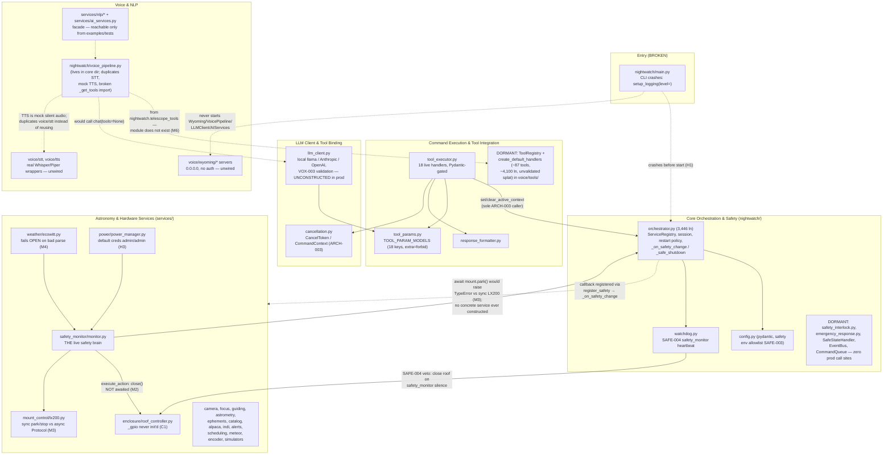

# NIGHTWATCH Architecture Synthesis (L5)

**Author:** Chief Architect (L5/L6 synthesis)
**Date:** 2026-07-12
**Inputs:** 00-inventory.md, 10-history.md, all five 20-domain-*.md reports, 30-security.md,
31-quality.md. Every claim below that carries major weight was spot-checked against source by this
author (file:line cited where re-verified). Disagreements between reports were resolved in code —
see §6, "Report conflicts resolved."

---

## 1. System overview

NIGHTWATCH is a voice-controlled autonomous observatory controller: a single-operator Python 3.11
system (~25k source LOC, 61 commits, 5.5 months old, v0.1.0-dev) intended to let an astronomer say
"point at M31" and have an LLM select a validated tool call that slews a real mount, while a
continuously-running safety engine watches weather/power/daylight and closes the roof and parks the
mount the moment conditions turn unsafe. Three physical layers: a core package (`nightwatch/` —
orchestrator, config, safety, tool dispatch, LLM client), a capability layer (`services/` — 22
modules for mount, camera, roof, weather, power, ephemeris, catalog, guiding, NLP, etc.), and a
voice layer (`voice/` — Whisper STT, Piper TTS, Wyoming network protocol, the 87-tool LLM schema
catalog).

**The single most important architectural fact:** NIGHTWATCH today is a set of well-built,
individually unit-tested components that do not form a running system. The documented entry point
crashes on a one-line kwarg bug (`nightwatch/main.py:308,325` pass `level=` to a function whose
parameter is `log_level` — verified); the orchestrator never constructs the LLM client, voice
pipeline, Wyoming servers, or any concrete hardware service (verified by grep: zero construction
sites in `nightwatch/main.py`/`orchestrator.py`); the tool-schema bridge from the 87-tool catalog to
the LLM imports a module that does not exist (`voice_pipeline.py:2086` — verified); and the
end-of-chain physical fail-safe — emergency roof close — fails for two independent, code-confirmed
reasons (uninitialized `_gpio` attribute; un-awaited async `close()`), both masked by broad
exception swallowing and test doubles. Meanwhile the CI pipeline is incapable of failing (12
`continue-on-error: true` occurrences plus `|| true`/`|| echo` on every real check — verified), so
none of this is visible on the green badge.

The engineering culture is genuinely disciplined where it operates: conventional commits traceable
to ADR-style specs (ARCH-/SAFE-/HWS-/VOX-), a thoughtful cooperative-cancellation design, a
deny-by-default safety env-var allowlist, parameterized SQL, no unsafe deserialization anywhere.
The pathology is not bad code — it is **breadth-first construction without integration**, by a
single author (97% of commits, one person under two identities), with no feedback loop (CI muted,
docs stale, no releases/tags) that would reveal the gap between "designed and unit-tested" and
"actually wired and running." The May 2026 hardening push (SAFE-001/002/004, ARCH-001/002/003)
shows the author knows exactly where the risks are; the review found that several of those specific
guarantees (SAFE-001 "EMERGENCY_CLOSE actually closes roof," SAFE-002 dual rain sensors) are not
delivered by the code as it stands.

Shape summary: **hub-and-spoke around a 3,446-line orchestrator god-file, with two parallel
half-assembled command stacks and a safety chain whose last physical link is broken.**

---

## 2. Module map

Domains, boundaries, and dependency direction. Solid arrows = live, verified call paths. Dashed
arrows = designed/intended dependencies that are currently broken or unwired (each annotated).



**Dependency direction (the rule the code mostly respects):** `services/*` modules do not import
`nightwatch/` (they are leaf capabilities driven from above); `nightwatch/` imports downward into
`services/` and `voice/`; `voice/tools` is imported by `voice/__init__` and (intended, broken) by
`nightwatch/voice_pipeline.py`. The shared contracts are `tool_params.TOOL_PARAM_MODELS` (consumed
by both `llm_client.py` and `tool_executor.py` — genuine single source of truth, verified 18 keys)
and duck-typed/Protocol service interfaces on the orchestrator (largely **unmet** by the concrete
implementations — see §5).

---

## 3. Data flow — the three paths that matter

### 3.1 Safety chain: weather event → roof closed (the path the system exists to guarantee)

```
Ecowitt gateway (plain HTTP, no auth)
  → EcowittClient._parse_response()          [FAILS OPEN: garbled JSON → "dry, 70°F" defaults (M4)]
  → SafetyMonitor.update_weather() → evaluate()  [correct: hysteresis, rain voting, priority order]
  → run(): _notify_callbacks() FIRST          [SAFE-001 ordering — correct by design]
      → Orchestrator._on_safety_change → cancels the single _active_context (ARCH-003)
  → execute_action(EMERGENCY_CLOSE)
      → mount.stop()/park()                   [sync LX200 — OK here, monitor calls sync]
      → _close_enclosure_safely()
          → self.enclosure.close()            [BREAK #1: close() is async def; not awaited —
                                               coroutine created, never runs (M2, monitor.py:1535)]
          → (if it ran) RoofController.close(emergency=True) → _run_motor()
                                              [BREAK #2: self._gpio never assigned in __init__;
                                               AttributeError swallowed by except Exception;
                                               state=ERROR, returns False (C1, roof_controller.py:848)]
Parallel fail-safe: WatchdogManager (SAFE-004) — safety_monitor heartbeat silence >90s
  → _execute_safety_veto → await enclosure.close(emergency=True)   [this path awaits correctly,
                                               but hits BREAK #2 identically]
```

Verdict: detection and decision logic are real and reasonably tested; **actuation is broken at the
last link, twice over, and the breakage is invisible** (both breaks are swallowed by
`except Exception` and both are patched out of the unit tests). SAFE-002's dual rain sensor
redundancy is also not real: `require_secondary_rain_sensor=True` by default but no secondary
driver exists anywhere and no config surface exposes the flag — wired as-is, the rain check could
never report safe; in practice the module isn't constructed from production at all.

### 3.2 Voice command: "slew to M31" → mount moves (the product's core loop) — broken in four places

```
[intended] Wake word/audio → STT → LLM(tools) → ToolExecutor → mount → ResponseFormatter → TTS

BREAK A: nothing constructs VoicePipeline/LLMClient/Wyoming servers from main/orchestrator
         (verified: zero construction sites outside tests/examples).
BREAK B: VoicePipeline._get_tools() imports nightwatch.telescope_tools (does not exist) →
         ImportError swallowed to a warning → tools=None → llm backends' `if tools:` gate means
         the model NEVER receives a function schema; VOX-003 validation never runs on real traffic.
BREAK C: VoicePipeline duplicates rather than reuses voice/stt (own faster-whisper wrapper) and its
         TTSInterface.synthesize() returns hardcoded silent WAV — Piper is never called on this path.
BREAK D: even if A–C were fixed, only 18 of the 87 advertised tools have live handlers + schemas;
         the LLM system prompt (TELESCOPE_SYSTEM_PROMPT) describes roof/power/PEC/INDI/Alpaca
         capabilities the live ToolExecutor cannot execute; the four "critical tools" in
         LLMClient.requires_confirmation aren't in TOOL_PARAM_MODELS so they'd be dropped as
         Unknown tool before the (never-called) confirmation gate could see them.
```

The live fragment that does work end-to-end (under tests): `ToolExecutor.execute()` →
Pydantic `extra="forbid"` validation → handler with per-handler safety veto → `ToolResult` →
`ResponseFormatter`. This 18-tool core is the best-engineered slice of the system.

### 3.3 Startup/shutdown lifecycle

```
bin/nightwatch → python -m nightwatch.main → main()
  [BREAK: setup_logging(level=...) TypeError on every invocation — H1, one-line fix]
  → load_config() (yaml.safe_load; env overrides; SAFETY allowlist deny-by-default — genuinely good)
  → Orchestrator(config) → start(): ServiceRegistry in registration order
  [GAP: nothing registers concrete services — registry would be empty in production]
  → _health_loop (30s is_running poll + exponential-backoff restart policy — the real liveness path)
  [Watchdog per-service heartbeats: never called for standard services → permanently UNKNOWN, inert]
SIGINT/SIGTERM → shutdown(safe=True) → _safe_shutdown():
  → get_for_shutdown() bypass (park/close even on ERRORed services — good, documented invariant)
  → await mount.park()  [would raise TypeError vs sync LX200Client if ever wired — M3]
  → _save_session_log() called twice (confirmed double-write bug, orchestrator.py:2059 + 2391)
  → "cancel all commands" step cancels _active_commands — a dead registry nothing populates;
    the real in-flight command (_active_context) is not cancelled on this path.
```

---

## 4. Design decisions inferred from the code

| # | Decision | Evidence | Still serves the project? |
|---|---|---|---|
| D1 | **Cooperative cancellation over hard task-kill (ARCH-003).** Long ops poll `CancelToken` at safe boundaries; safety callbacks cancel before the roof physically moves (SAFE-001 ordering). | `nightwatch/cancellation.py:1-38`; `tool_executor.py:339-406` sole caller of `set_active_context`; `monitor.py:1607-1653` notify-then-act with settle window | **Yes — keep.** Correct for hardware that corrupts state on mid-write kill. Two gaps: single active context only (second command silently displaces the first), and the orchestrator's older hard-cancel system (`execute_cancellable`/`_active_commands`) is dead code that makes both shutdown paths' "cancel all commands" a no-op. Delete the old system. |
| D2 | **Single Pydantic schema registry, deny-unknown-fields, validated twice (ARCH-001 + VOX-003).** One `TOOL_PARAM_MODELS` dict consumed by both LLM client (pre-response) and executor (pre-dispatch); `extra="forbid"`; explicit bool-coercion rejection for RA/Dec. | `tool_params.py:160-185` (18 keys, verified); `llm_client.py:737-774`; `tool_executor.py:302-331` | **Yes — the strongest pattern in the repo.** But it is undermined by its dormant sibling `ToolRegistry.execute()`'s raw `handler(**arguments)` splat (`telescope_tools.py:1389`) — the exact hole ARCH-001 closed, sitting in the same package. Delete or subordinate ToolRegistry to the registry. |
| D3 | **Deny-by-default safety env override allowlist (SAFE-003).** `NIGHTWATCH_SAFETY_*` env vars rejected unless allowlisted; allowlist ships empty. | `config.py:90`, enforcement `:920-941`, well tested (`test_config.py:395-505`) | **Yes.** Correctly implemented and tested; a model for how the rest of the config surface should treat safety-relevant knobs (PDU creds, Wyoming bind address currently get no such treatment). |
| D4 | **Orchestrator as Protocol-typed service hub with a RUNNING-only gate plus explicit shutdown bypass (ARCH-002).** Command path sees only RUNNING services; the three safety-shutdown sites use `get_for_shutdown()` so an ERRORed mount still gets parked. | `orchestrator.py:871-1135` (Protocols), `:1254/:1282` (accessors), documented rationale inline | **Design yes, execution no.** The Protocols are unmet by nearly every concrete class (sync vs async mount, `is_safe` missing on SafetyMonitor, camera/power attribute mismatches — M3), and no bootstrap constructs any concrete service. A Protocol conformance test (one parametrized test per service) would convert this from aspiration to contract. |
| D5 | **"The monitoring loop must never die": broad except-and-continue on the safety path.** | 437 `except Exception` sites repo-wide; `monitor.py:1526-1530` stated rationale; bare `except:` returning `{"success": True}` at `power_manager.py:309` | **No longer, as applied.** Defensible for the loop itself, but applied uniformly it converted three safety-critical code defects (C1, M1, M2) into quiet log lines, and tests mock around rather than through the swallowing. Rule needed: any swallow on a safety/hardware path must pair with a structured alert and at least one unmocked-path test. |
| D6 | **Local-first inference with cloud fallback.** Local llama.cpp primary; Anthropic/OpenAI as per-call fallback chain; API keys from env, never config. | `llm_client.py:325-657`, fallback loop `:920-923`; keys `:454,572` | **Yes in principle** (an observatory shouldn't depend on the internet), but unwired, and the local backend blocks the event loop (no `to_thread`), which conflicts with D1's premise the moment it shares a loop with the safety monitor. Key handling bypassing `NightwatchConfig` entirely is an inconsistency to resolve (config has no `api_key`/`endpoint` fields at all — inventory report was wrong on this; verified). |
| D7 | **Breadth-first scaffolding: build every subsystem to spec, wire later.** | Five dormant core subsystems (`SafetyInterlock`, `EmergencyResponse`, `SafeStateHandler`, `EventBus`, `CommandQueue`); ~4,100-line dormant handler set; `constants.py`/`types.py`/`exceptions.py` largely unreferenced; voice/NLP built once 2026-01-20 and never revisited (verified in git) | **No — this is the central pathology.** It manufactures false assurance (reviewers see defense-in-depth that isn't enforced), duplicates sources of truth (constants vs config threshold drift — confirmed), and produces the "well-tested bridge to nowhere" grade pattern in 31-quality.md. The project needs an explicit wire-or-delete triage per dormant subsystem. |
| D8 | **LAN-trust network model.** Wyoming servers plaintext, no auth, `0.0.0.0`, enabled by default; Ecowitt/PDU/Alpaca plaintext HTTP; mDNS advertisement by design. | `config.py:346-420`; `stt_server.py:116,234-238`; `power_manager.py:50-55,147`; 30-security.md H3/H4/M5 | **Acceptable only if made explicit and bounded.** Currently it is implicit and unbounded (default `0.0.0.0` + default creds + fail-open weather parse + unbounded audio buffer). Minimum: loopback defaults, no working default credentials, documented trust boundary. |
| D9 | **Spec-traceable conventional commits (ARCH-/SAFE-/HWS-/VOX-/DEP- + Risk #).** | 10-history.md §5; commit samples | **Yes — keep and extend.** The traceability discipline is real and rare at this repo age. Its blind spot: specs are marked "Complete" when the code exists, not when it is wired and integration-tested (e.g., ToolChain Step 267 "Complete" while non-functional; SAFE-001 claimed while roof close is broken). Definition-of-done must include an integration-path test. |
| D10 | **CI as advisory-only during bootstrap.** Every job muted via `continue-on-error`/`|| true`. | `.github/workflows/ci.yml` (12 occurrences verified); 31-quality.md Q1 | **No.** Whatever its origin (probably pragmatism while the suite stabilized), it now hides a broken install (unsatisfiable `pyindi-client~=2.0.8` pin), a crashing entry point that mypy itself flags, 48 test failures, and 48.25% coverage vs a 60% configured floor. One gated unit-test job + gated `mypy nightwatch/` would have caught H1 before it shipped. |

---

## 5. Coupling and boundary violations worth naming

1. **`nightwatch/voice_pipeline.py` violates the voice-domain boundary from the core side.** It
   lives in the core package but reimplements STT from scratch (its own `faster_whisper` wrapper)
   instead of reusing `voice/stt/WhisperSTT`, ships a mock-silent-audio TTS instead of calling
   `voice/tts/PiperTTS`, and imports a nonexistent module for tool schemas. Two parallel voice
   stacks now exist, one real-but-unwired and one wired-but-fake. Also `webrtcvad` is declared in
   `voice/requirements.txt` but imported only by this core-package file — dependency ownership
   inverted.

2. **Two command-dispatch stacks with different validation regimes for overlapping tool names.**
   `ToolExecutor` (Pydantic, `extra="forbid"`, logged) vs `ToolRegistry` (raw `handler(**args)`
   splat, unlogged catch-all, stubbed emergency audit log). The dormant one is 4x larger than the
   live one and is the largest file in the repository. This is the highest-value delete-or-integrate
   decision in the codebase.

3. **Two liveness systems, one real.** `Orchestrator._health_loop` (30s `is_running` poll +
   restart policy) does the work; `WatchdogManager`'s per-service heartbeat configs for
   mount/weather/camera/etc. never receive a heartbeat (verified: no `watchdog.heartbeat(` call
   sites in orchestrator) and sit at UNKNOWN forever. Only the SAFE-004 safety_monitor heartbeat
   path is wired. A critical-service failure other than safety_monitor silence produces a log line,
   not a safe-state action, because `set_safe_state_callback` is never called.

4. **Duck-typed cross-domain contracts, systematically unmet.** `await mount.park()` vs sync
   `LX200Client.park()`; `roof.get_state()` expected by `emergency_response.py`/`watchdog.py` vs
   the real `state` property; `SafetyMonitor` lacking the `is_safe` property its Protocol demands;
   `MeteorToolHandler` parsing a sibling service's free-text string output by substring. All are
   invisible to unit tests built on `MagicMock`, which fabricates any attribute. A conformance test
   per Protocol is the cheapest structural fix in the repo.

5. **Duplicated sources of truth that have already drifted.** `constants.py` flat safety thresholds
   vs `SafetyConfig` three-tier thresholds (confirmed drift: 25.0 flat vs 20/25/30); two
   incompatible `SafetyInterlockError` classes; two pytest configurations (only `pytest.ini` is
   live; `pyproject.toml`'s block — including `--strict-markers` and the 30s timeout — is silently
   dead); two coverage thresholds (60 configured, 80 hand-rolled in CI), neither enforced.

6. **Config-boundary bypass for secrets.** LLM API keys read straight from `os.environ` in
   `llm_client.py`, invisible to `NightwatchConfig` validation and to the safety env-allowlist
   machinery; PDU credentials are dataclass defaults (`admin`/`admin`, `private`) rather than
   config-sourced requirements.

7. **Orphan facade at the domain seam.** `services/ai_services.py` — the only code that assembles
   the NLP stack — sits at `services/` top level, outside every domain directory, reachable only
   from `examples/` and tests. It was missed by the inventory decomposition (caught by the voice
   analyst's memory notes) and is where any future NLP wiring will either happen or rot.

8. **Deployment artifacts reference code that doesn't exist.** `nightwatch-wyoming.service`
   ExecStart's `python -m voice.wyoming_server` has no corresponding module (verified);
   `README`/QUICKSTART document `python -m nightwatch.cli` which doesn't exist. The deploy layer is
   coupled to an imagined codebase, not this one.

---

## 6. Report conflicts resolved (fact-checked in code)

| Conflict | Resolution |
|---|---|
| **00-inventory.md §6.1** says the `llm` config section holds "model, endpoint, api_key" vs **20-domain-llm** saying `LLMConfig` has no such fields | **Inventory wrong.** Verified `nightwatch/config.py:436-479`: fields are `enabled`, `model`, `max_tokens`, `temperature`, `gpu_layers`, `context_length` only. API keys live solely in env vars read by `llm_client.py`. |
| **00-inventory.md §7.4** attributes SAFE-002 rain voting and SAFE-004 watchdog to `nightwatch/safety_interlock.py` | **Inventory wrong/imprecise.** SAFE-002 voting lives in `services/safety_monitor/monitor.py:553`; SAFE-004 in `nightwatch/watchdog.py:505`. `safety_interlock.py` is a separate, production-unwired gatekeeper (core-orch report correct). |
| **10-history.md §4.1** abandoned-zones list omits voice/ and services/nlp vs **20-domain-voice-nlp** extending it | **Historian under-counted.** Verified in git: `voice/stt`, `voice/tts`, `voice/wyoming` last commit 2026-01-20; `services/nlp` last commit 2026-01-20. The 2026-05-25 activity under `voice/` is exclusively `voice/tools/telescope_tools.py` (Command Execution domain). Voice analyst correct, with that caveat. |
| **00-inventory.md §7.3** implies `tests/hardware/` are real tests "skipped in CI" vs **31-quality Q10** | **Inventory wrong.** Class names don't match pytest's `Test*` pattern; `--collect-only` yields 0 items. They are manual CLI scripts, never collectible tests. |
| Historian anomaly: main branch 27 days stale, all work on a review branch; pre-commit "mandatory" | Confirmed context, not conflict: pre-commit blocks direct main commits but nothing enforces hook installation (74% of files fail `ruff format --check`), and no PR/review process exists (1 merge commit in 61). Governance is aspirational. |

No other material disagreements were found; 31-quality.md independently confirmed or reproduced
every domain-level quality flag, and 30-security.md confirmed, down-ranked, or cleared every
security flag with stated reasons. This synthesis found no case where a domain analyst's concrete
code claim was wrong.
